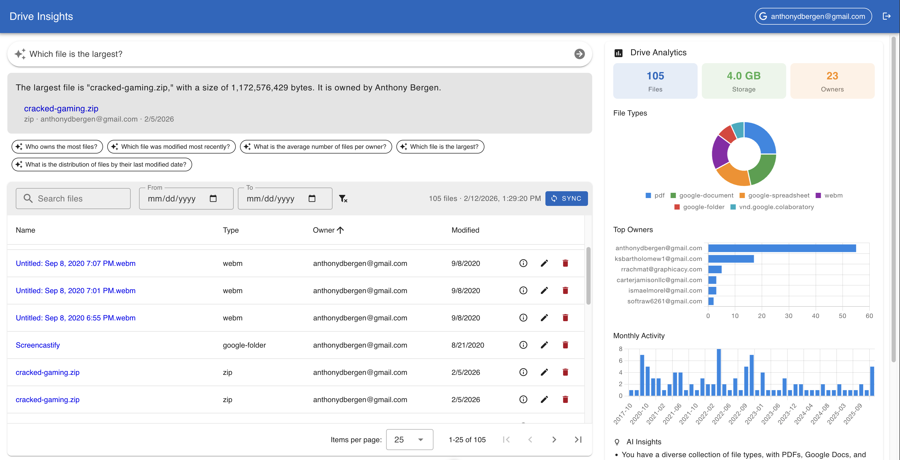

# Drive Insights

A full-stack application that connects to Google Drive, syncs file metadata into a local database, and provides analytics, natural language querying, and AI-powered insights.



## Tech Stack

| Layer     | Technology                                      |
| --------- | ----------------------------------------------- |
| Frontend  | Vue 3, Vuetify 3, Pinia, Chart.js, TypeScript   |
| Backend   | Express 5, Prisma 7, TypeScript                  |
| Database  | PostgreSQL 18                                    |
| AI        | OpenAI GPT-4o-mini                               |
| Auth      | Google OAuth 2.0, JWT (httpOnly cookies)         |
| Tooling   | pnpm workspaces, Vite, tsx, Docker Compose       |

## Prerequisites

- Node.js >= 24
- pnpm
- Docker (for PostgreSQL)
- Google Cloud project with OAuth 2.0 credentials (Drive API enabled)
- OpenAI API key (optional — only needed for AI features)

## Setup

```bash
# 1. Install dependencies
pnpm install

# 2. Copy environment variables
cp .env.example .env
# Fill in GOOGLE_CLIENT_ID, GOOGLE_CLIENT_SECRET, JWT_SECRET, and optionally OPENAI_API_KEY

# 3. Start PostgreSQL
docker compose up -d

# 4. Run database migrations
pnpm db:migrate

# 5. Start development servers (client + server concurrently)
pnpm dev
```

The client runs at `http://localhost:5173` and proxies API requests to the server at `http://localhost:3000`.

## Architecture

```
drive-insights/
├── client/                 # Vue 3 SPA
│   └── src/
│       ├── components/     # AiQueryCard, AnalyticsDashboard, FileTable
│       ├── stores/         # Pinia stores (auth, sync, files, analytics)
│       ├── views/          # HomeView (single-page layout)
│       └── utils/          # Formatters (mime types, dates, bytes)
├── server/                 # Express API
│   ├── prisma/             # Schema + migrations
│   └── src/
│       ├── lib/            # Shared singletons (prisma, openai)
│       ├── middleware/      # JWT auth middleware
│       ├── routes/         # auth, sync, files, query, analytics
│       └── services/       # google-auth, drive-sync, ai-query, analytics
└── docker-compose.yml      # PostgreSQL
```

### Request Flow

1. **Auth**: Google OAuth -> server exchanges code for tokens -> stores in DB -> issues JWT cookie
2. **Sync**: Client triggers sync -> server fetches Drive file metadata via Google API -> upserts into PostgreSQL
3. **Files**: Server-side pagination, search, date filtering, and sort — all scoped to the authenticated user
4. **Analytics**: Six parallel Prisma queries (count, sum, groupBy) -> charts rendered with Chart.js
5. **AI Query**: Natural language -> GPT classifies intent -> Prisma query -> GPT synthesizes answer
6. **AI Insights**: Analytics JSON -> GPT generates 3-5 actionable insights (cached, rate-limited)

### API Endpoints

| Method | Path                    | Description                          |
| ------ | ----------------------- | ------------------------------------ |
| GET    | `/api/auth/google`      | Initiate OAuth flow                  |
| GET    | `/api/auth/google/callback` | OAuth callback                   |
| GET    | `/api/auth/status`      | Check auth status                    |
| DELETE | `/api/auth/disconnect`  | Disconnect account and clear session |
| POST   | `/api/sync`             | Sync Drive file metadata             |
| GET    | `/api/sync/status`      | Last sync timestamp + file count     |
| GET    | `/api/files`            | Paginated file list with filters     |
| PUT    | `/api/files/:driveId`   | Rename a file (Drive API + DB)       |
| DELETE | `/api/files/:driveId`   | Trash a file (Drive API + DB)        |
| POST   | `/api/query`            | Natural language file query           |
| GET    | `/api/analytics`        | Aggregated file statistics            |
| GET    | `/api/analytics/insights` | AI-generated insights              |

## Key Design Decisions

### Multi-User Scoping

Every database query includes `userEmail` in its WHERE clause. OAuth tokens and file metadata are isolated per user. This was a deliberate choice over a single-tenant design to demonstrate production-readiness.

### JWT in httpOnly Cookies

Tokens are stored in httpOnly, sameSite strict cookies rather than localStorage. This prevents XSS from accessing the token. In development, the Vite proxy keeps requests same-origin. In production, CORS is restricted to `CLIENT_ORIGIN` and credentials are enabled for secure cookie transport.

### Database-Level Aggregation

Analytics uses Prisma `groupBy`, `count`, and `aggregate` instead of fetching all rows and computing in memory. Six queries run in parallel via `Promise.all`. Composite indexes on `[userEmail, trashed]`, `[userEmail, modifiedTime]`, and `[userEmail, ownerEmail]` keep these fast.

### AI Query: 3-Step Pipeline

The natural language query feature uses a classify -> execute -> answer pipeline rather than letting the LLM generate SQL directly. This keeps the LLM as a structured intent parser (constrained JSON output), executes queries through Prisma's type-safe API, and uses a second LLM call only for natural language synthesis. This avoids SQL injection risks entirely.

### AI Insights: Dual-Layer Caching

The insights endpoint has both server-side (5-min TTL, fingerprint-keyed Map) and client-side (fingerprint comparison to skip refetch) caching. Rate limiting (5 requests/min/user) protects against abuse. The OpenAI prompt explicitly forbids inventing data not present in the analytics JSON.

### Graceful Degradation

OpenAI features are optional. If `OPENAI_API_KEY` is not set, the server still runs — AI endpoints return 503 and the UI shows "No insights available." The core file browsing, sync, and analytics features work without it.

## Tradeoffs

- **In-memory rate limiting and caching**: Simple and sufficient for a single-server deployment, but would need Redis for horizontal scaling.
- **Month aggregation in-memory**: Prisma doesn't support `date_trunc`, so monthly activity is computed in application code after fetching `modifiedTime` values. For very large file collections, a raw SQL query or materialized view would be more efficient.
- **Sync fetches all files**: The initial sync pulls all Drive file metadata. For accounts with tens of thousands of files, incremental sync using Drive's `changes` API with a `startPageToken` would be better.
- **No WebSocket for sync progress**: Sync status is polled by the client. A WebSocket or SSE connection would provide real-time progress feedback.
- **BigInt size field**: Google Drive reports file sizes that can exceed JS `Number.MAX_SAFE_INTEGER`. The schema uses `BigInt`, and all API responses serialize to `Number` at the boundary. For extremely large values this could lose precision, but in practice Drive file sizes are well within safe range.

## Scripts

```bash
pnpm dev          # Start client + server
pnpm build        # Build both packages
pnpm typecheck    # Type-check both packages
pnpm lint         # Lint client (oxlint + ESLint)
pnpm db:migrate   # Run Prisma migrations
pnpm db:generate  # Regenerate Prisma client
pnpm db:push      # Push schema to DB (no migration)
pnpm db:studio    # Open Prisma Studio
```
